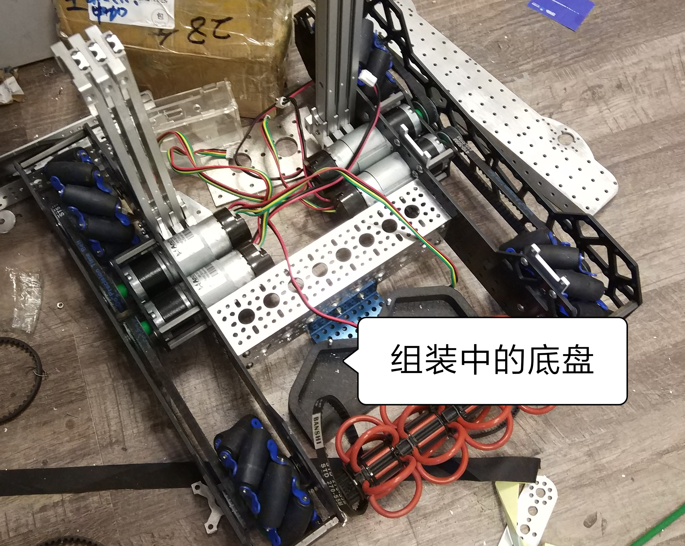
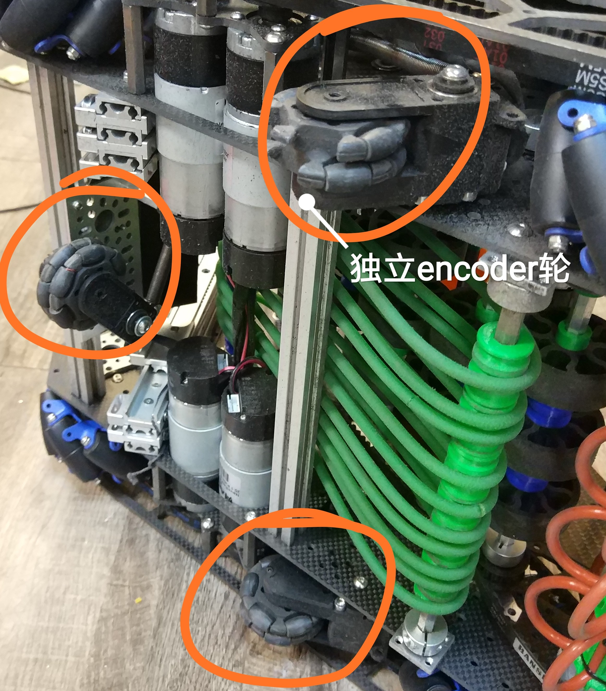
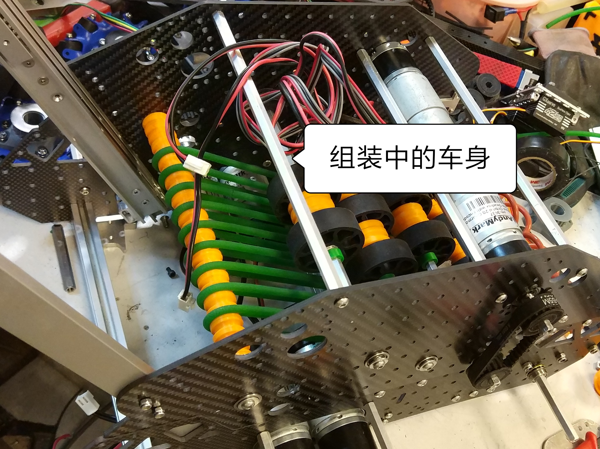
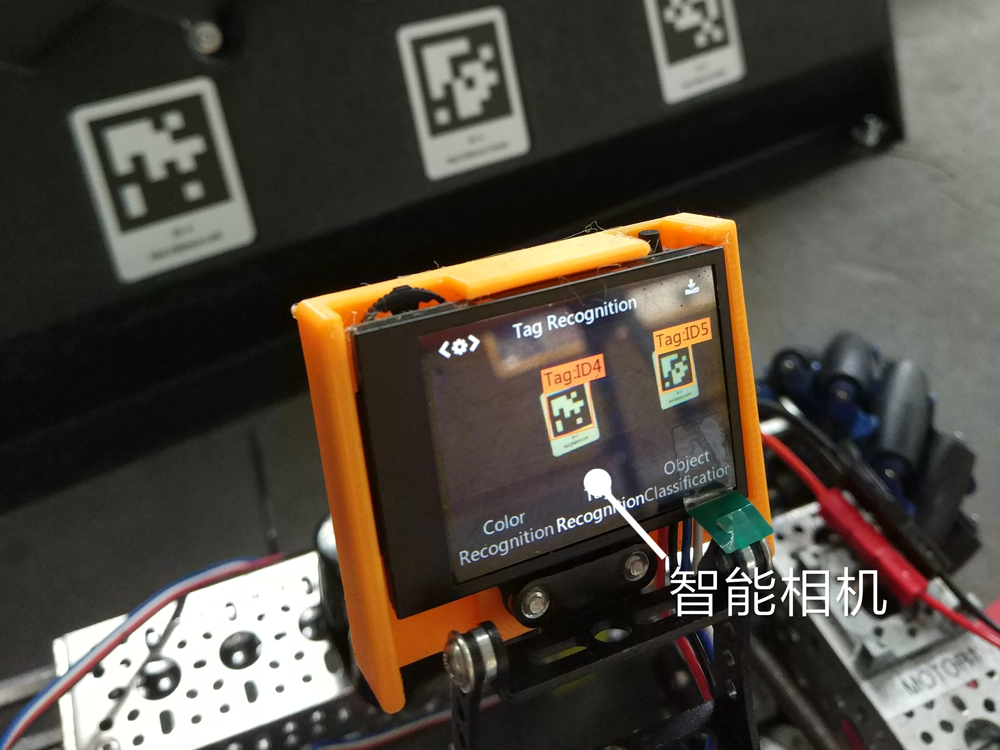

# FTC 2024 CENTERSTAGE 机器工程笔记(软件)
by 19581 **"IRON MAPLE"**

## 我们的队伍
今年，我们的队伍由几名参加过ftc比赛的高二队员和十名高一新队员组成。过去三个月内，机械组的同学们在老师的指导和帮助下完成了这套原创的机器的设计，并动手制作了它。高一的新队员也在过程中学习了很多知识，他们参与制作了一些难度适合初学者的组件。
<合影放这里>

## 底盘设计
- 我们的底盘采用麦克纳姆轮驱动，最大的优点是灵活，可以向任何方向做平移运动。但是，麦克纳姆轮的痛点一直是平移的会有不一定的阻力导致平移不精准，因此其他部分队伍的自动阶段机器无法直线平移。
 
- 所以，我们加入了独立编码器来为机器提供位置导航。三个从动轮被放置在机器底部，弹簧提供压力使轮子始终着地。它们负责感应机器的移动，为控制程序提供精准定位。

## 上层结构
- 车身外壳大多为全碳纤维打造，在尽量保持低重量的同时保证机器坚固可靠。机器人的碳钎维进行了镂空处理，保持高强度的情况下进一步减重。
- 主要的零部件——例如电机——占了我们车重的大部分，我们通过在底盘上放置4个电机，上层放置3个电机来稳定车身重心。
 
- 吸取模块参考2020年机器的滚动结构设计，通过滚动的软性的橡皮圈和运动的TPU皮带实现吸取，经过数次改进后有较高成功率
- 升降由的伸缩杆实现，伸缩杆顶端连接着爪子。我们对爪子进行了创新，经过多次返工后决定使用平行舵机带动柔性抓手完成对道具的夹取

## 传感器
- 机器前部配备有husky智能相机和距离传感器，用于自动瞄准板子上的导航二维码。我们在放置道具的时候会使用husky智能相机配合距离传感器实现对板子3个方位的自动瞄准，2m激光距离传感器对板子底部进行距离测量。
 
- 后部则配备有网络摄像头，用于控制自动吸取，我们使用一个网络摄像头来瞄准像素。

## 程序设计

### 1. 从动轮导航系统

 *从动轮导航系统(测试车）*

- 我们使用从动轮来感知机器的运动，计算机器的位置、速度、加速度等。
每个从动轮上配有编码器，可以读取从动轮转了多少圈，以此推算出从动轮的位移
- 但是，从动轮的位移并不一定就是机器的位移，机器的旋转也会让从动轮转动，这就会造成误差。我们的解决方案是：**1. 使用对称、平行排列的竖直从动轮求平均值消除误差。 2.平行从动轮做差得出旋转量，推算出横向从动轮的误差，并从原始数值中减掉**
- 关键部分代码展示:

### 2. PID动态轨迹修正系统
- 有了从动轮提供的导航信息，我们建立了一套兼顾灵活、精准、易用的控制系统。这套系统的核心是动态轨迹纠正系统

- 当驾驶员输入移动命令后，系统首先根据自身IMU获取的方向对驾驶员输入进行变换，使机器的移动方向永远和驾驶员参照系的方向一致，不论机器朝向。这个功能简称“无头模式”
- 而且，机器在运动途中，从动轮会实时监测机器的实际运动，如果与驾驶员的输入存在误差，会用PID算法进行校正，使机器走一条直线

### 3. 自动瞄准系统
- 绝大多数队伍的机器在手动阶段需要驾驶员自己控制机器接近目标并放置pixel，这样不仅需要浪费很多时间反复微调，还有可能操作不慎装上目标。
- 对此，我们设计了一套继集编码器、智能摄像头和TOF距离传感器三种感知方式于一体的自动瞄准系统

- **第一阶段: 自动接近** 当驾驶员按下手柄上的自动瞄准案件，机器会首先通过智能摄像头计算出目标的大概位置。但是，智能摄像头存在延迟、帧率较低、容易丢失目标等问题。所以，这期间地盘会用从动轮编码器感应自身位置，用PID算法接移动到目标前面，同时正对目标。
- **第二阶段：自动贴合**当机器到达目标面前，tof距离传感器启动，感知目标距离；而智能摄像头则负责感应目标的水平偏差。机器会在0.7秒内完成自动贴近目标
- **第三阶段: 微调位置** 当机器完全贴近目标，驾驶员通过手柄选择具体瞄准位置。程序会自动保持与板子的距离（精度 <= 1cm）并调整机器水平位置直到完成瞄准。
- 三个阶段总共用时**不到4秒**

### 4. 程序优化
- 相比于传统的线性程序，我们的代码使用多线程运行。机器的所有功能，比如地盘、编码器、摄像头、抓手、升降臂被分割成立不同程序模块。这些模块以多个线程平行运行，以提升程序性能。
- 我们设计了一个任务管理器，可以让不同模块以不同频率更新。比如地盘涉及到PID导航，对更新速度要求跟高，程序会以80次每秒读取驾驶员指令并更新地盘状态，以此保证绝对的丝滑流畅。而对于吸取这种逻辑简单的模块，一秒只更新25次，节省cpu资源。

