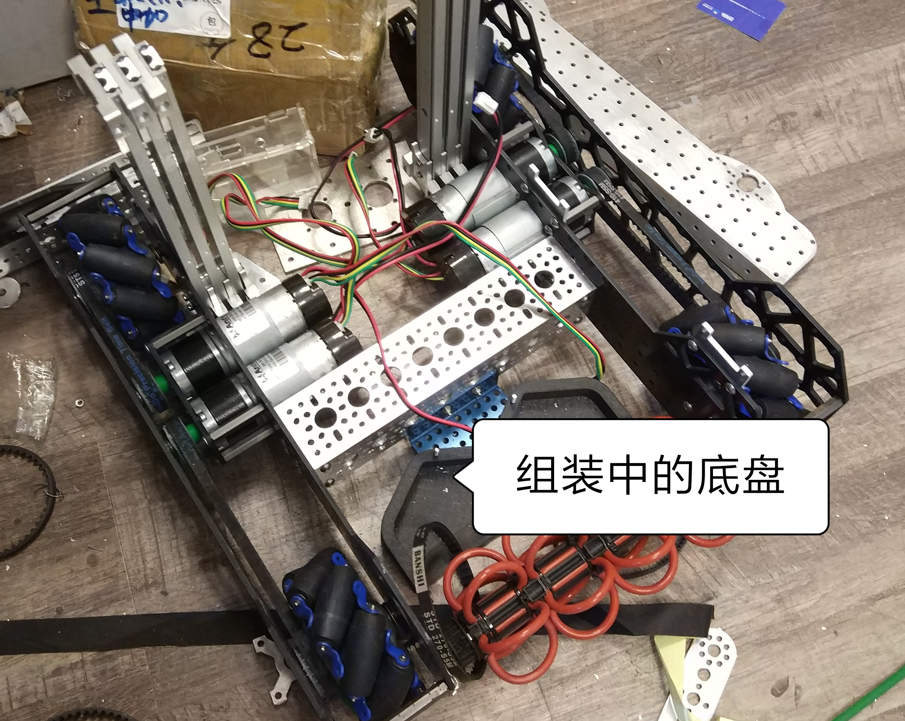
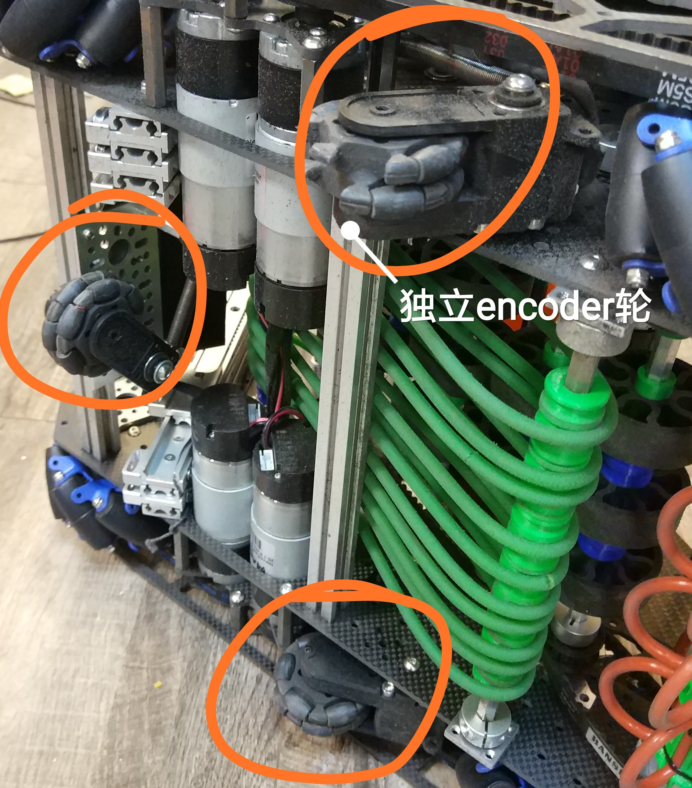
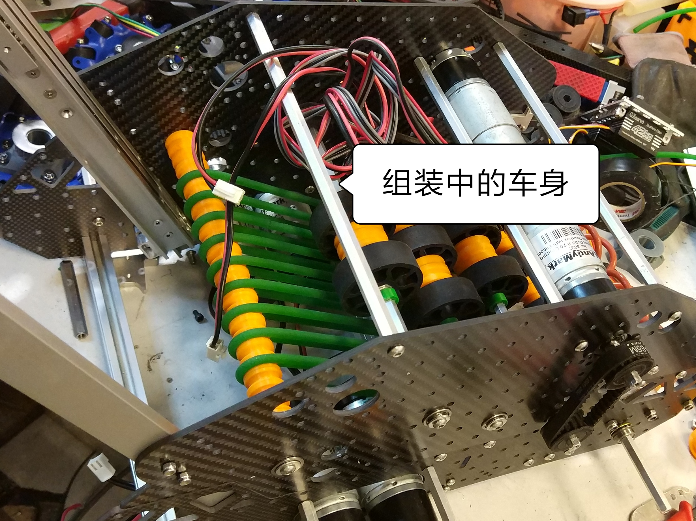
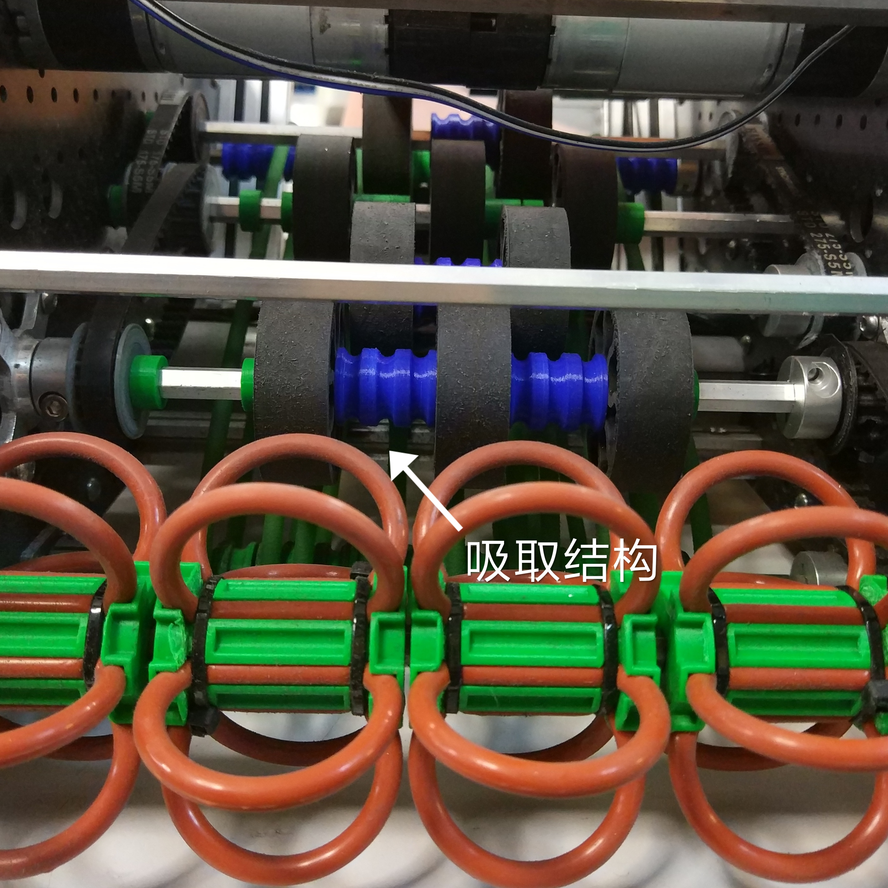
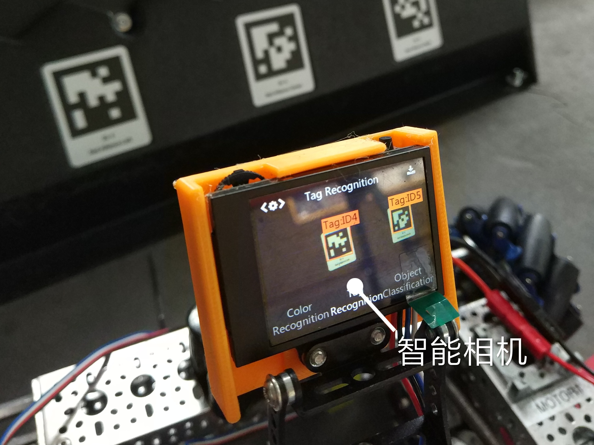

# FTC 2024 CENTERSTAGE 机器工程笔记(软件)
by 19581 **"IRON MAPLE"**

## 我们的队伍
今年，我们的队伍由几名参加过ftc比赛的高二队员和十名高一新队员组成。过去三个月内，机械组的同学们在老师的指导和帮助下完成了这套原创的机器的设计，并动手制作了它。高一的新队员也在过程中学习了很多知识，他们参与制作了一些难度适合初学者的组件。
<合影放这里>

## 底盘设计
- 我们的底盘采用麦克纳姆轮驱动，最大的优点是灵活，可以向任何方向运动。但是，精准度一直是麦克纳姆轮的痛点
 
- 所以，我们加入了独立编码器来为机器提供位置导航，三个从动轮被放置在机器底部，感应机器的移动。弹簧提供压力使轮子始终着地。配合上我们的控制程序，就可以完成非常精准的万向移动

## 上层结构
- 车身为全碳纤维打造，保证机器坚固可靠
 
- 吸取模块参考了我们2020年机器的滚动结构，通过滚动的毛刷和运动的皮带实现吸取，经过数次改进后有较高成功率
- 升降由的伸缩杆实现，伸缩杆顶端连接着爪子。我们对爪子进行了创新，经过多次返工后决定使用平行舵机带动柔性抓手完成对砖块的夹取

## 传感器
- 机器前部配备有智能相机和距离传感器，用于自动瞄准

- 后部则配备有usb摄像头，用于控制自动吸取

## 程序设计

### 1. 从动轮导航系统

