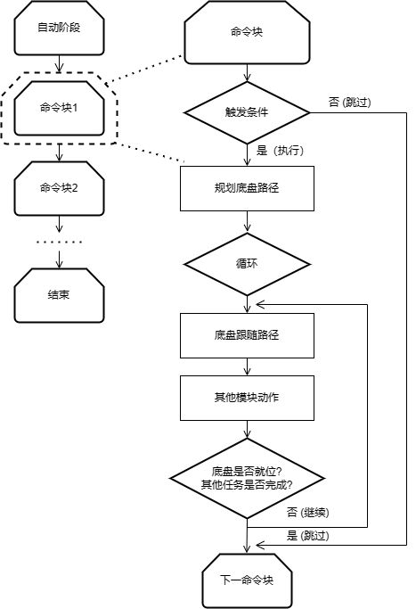

# 程序部分
## 一、从动轮导航系统

#### 基本原理

  
  

- 我们使用了从动轮来感知机器的运动，计算机器的位置、速度、加速度等。
每个从动轮上配有编码器，可以读取从动轮转了多少圈，以此推算出从动轮的位移
- 但是，从动轮的位移并不一定就是机器的位移，机器的旋转也会让从动轮转动，这就会造成误差。我们的解决方案是：

    1. **计算竖直方向方向位移** 使用对称、平行排列的竖直从动轮求平均值消除机器旋转带来的误差误差 $$
    \text{竖直平移量} = \frac{\text{右轮移动量} + \text{左轮移动量}}{2}
    $$
    2. **计算旋转** 左右从动轮相减得出旋转量 $$
    \text{旋转量} = (\text{左轮移动量} - \text{右轮移动量}) \times \text{比例k} $$

- 接下来，进行微分/积分就可以得到机器的位置或速度
    1. **计算速度** 对机器平移进行微分
    $$
\mathbf{机器速度} = \left(\frac{d\mathbf{平移量}}{dt}\right)^\text{机器朝向}
$$
    2. **计算平移量** 对机器位移进行路径积分 $$
\text{机器位置} = \int \text{d平移量}^\text{机器朝向}
$$

#### 校准方式

绝大多数队伍在使用从动轮时，需要知道三个轮子之间的确切相对位置，然而，机器在制作时存在公差，并不能保证精确。
所以，我们写了一套校准程序，直接测量机器的读数，并画出回归线，以此测算出正确的参数

### 自动阶段路径规划

- 我们将FRC中的PathPlanner下放到了机器当中。PathPlanner是由FRC Team 3015创建的FRC运动轮廓生成器。其优点在于：
1. **我们可以精确地对每条路径进行微调，其每条路径都是用贝塞尔曲线制作的**

