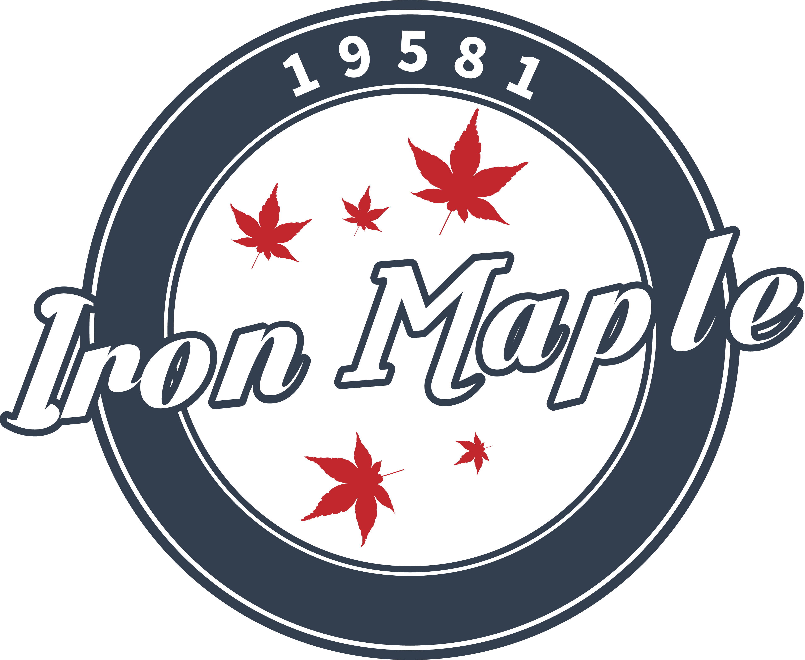

# 控制奖申请表

#### 自动阶段目标 Autonomous Objectives

#### 使用的传感器 Sensors Used

#### 关键算法 Key Algorithms

#### 操作控制优化 Driver Controlled Enhancements

#### 工程笔记摘要的参考 Engineering Portfolio References

#### 图解自动模式 Autonomous Program Diagrams:
